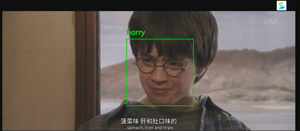

# FaceRecognizer

#### 介绍
多媒体大作业，视频人物识别

#### 软件使用技术
- opencv
- face_recognition
- flask


#### 安装教程

1.克隆源码

2.安装依赖

```
pip install flask dlib face_recognition
```

3.设置环境变量

```
export FLASK_APP=facer
```

4.运行flask服务

```
flask init-db #如果是第一次运行，需要先运行该命令初始化数据库
flask run
```

#### 使用说明

1.访问http://127.0.0.1:5000进入主界面


2.选择文件并上传，可以使用源码目录下facer/static/video/example-video.mp4示例


3.点击检测人脸，界面中出现需要进行标注的新脸，标注并逐一提交后，再次点击检测人脸


4.到源代码目录下facer/static/video/processed_video.mp4下查看添加标记后的视频，可见在人脸出现的地方被画上了矩形框，并标上了对应的名字


